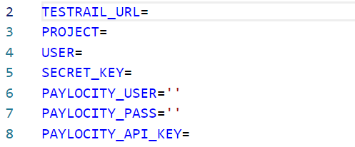
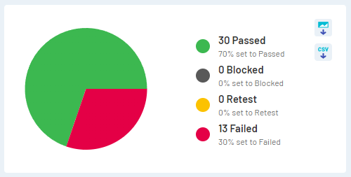
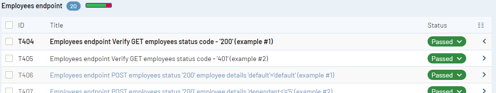
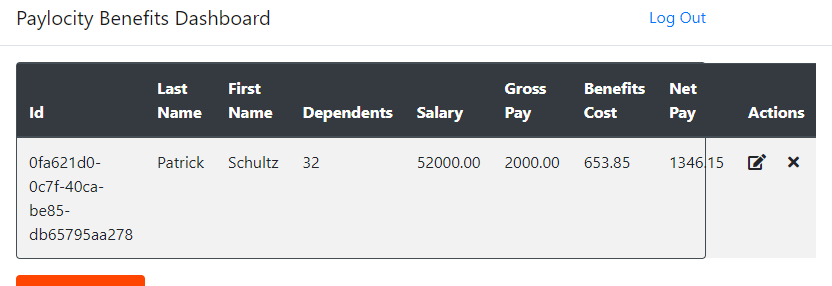

# Project Structure - includes UI and API tests

**Spec files** and **feature files** are placed under the e2e/ directory. These include BDD and step definitions.

**Page files** that return objects and helper functions fall under Main/

**Fixture files** that maintain a handful of API json payloads fall under fixures/

**Reports** directory is used to aggregate junit.xml files that get reported to testrail

**Screenshots** directory will contain screenshots from failed tests

# Setup 

Install latest version of **Node.js** => https://nodejs.org/en -v 20.16
- This will include the ***npm** package manager required 

In pwsh/cmd **run npm install** at the root directory of the project (this directory)

To ensure credentials are abstracted from the tests, a **.env file is gigitnored** and will **need to be contructed** at the root directory. Below is an example.

- Only the user credentials for the **paylocity app are required**. These credentials are accessed through env variables during test runs using dotenv. **Wrap user and pass in quotes.** 
            

Once dependencies are installed and .env is constructed, you'll have several options. Each command will run a separate feature file. These scripts are within the package.json.

- npm run test-api
- npm run test-login
- npm run test-dashboard
- npm run test 
    - test-all requires testrail credentials that aren't provided right now

# TestRail integration
**A provisioned read-only account is accesible on my TR trial instance. Credentials will be emailed**

This current iteration utilizes the .env to access TestRail credentials, then junit and junitparser aggregate the xml test files for trcli (testrail cli) to automatically update test cases and test runs. Man, that's a mouthful of a sentence.. sorry. This process is made easy with one script in the package JSON. **"npm run test"**! Another convenience in running this command is its pre and post test scripts. PreTest runs resource cleanup prior to execution, while Posttest carries out the automated reporting.

# QOL improvements noticed

- After running the swagger.yaml through linter-openapi with default preferences, quite a few warnings and errors were thrown. These can be seen in "swagger_schema_warnings.txt". Some of these may be fines, but its worth looking at. I worked on a handful of microservices, and standardization is extremely important. 

- Session authentication management should be looked at, the application throw 401s randomly, and after looking at the cookies or for a jwt, it seems this is a backend issue. 

- Failed validations done on add/edit user are nonexistent outside of looking at dev tools. Recommend adding toast notifications.

- The row fields within the table could use additional ccs data-test tags for selectors in automation. Relying on the posistioning of a field's index isn't ideal and leads to flaky tests. If the table is ever updated, this would create a ton of automation tech debt. 

- Reset password options on the login page would be nice. 

# Frontend & API bugs

- **Login with nonexistent user throws a 405**
    - Expected results would be 401
    - Steps:
        - Navigate to the /Accounts/Login page
        - Enter incorrect information in both input fields
        - Verify '405 Method Not Allowed' error 
    
    Note: This is also the case for several other API calls 

- **Session auth management intermittently failing** 
    - Expected - Session authenication should be refreshed after specified time limit
    - Steps:
        - Login to the application 
        - Create a user
        - Wait roughly 5 minutes
        - Refresh the page
        - Verify GET employees throws a 401

    Note: I don't see a JWT auth token stored in session storage, and the cookies are not being refreshed. I expect this is a backend issue. 

- **Dashboard can be accessed without logging in** 
    - Expected - Without authentication, the user should be redirected to the login page. Thankfully, the GET employees endpoint properly throws a 401, so information is not leaked.  
    - Steps:
        - Navigate directly to the dashboard
        - Verify the non authenticated user is not redirected to login

- **Dashboard is mismatching first and last names in the table**
    - Expected - The correct employee detail is displayed in the table
    - Steps:
        - Login to the application
        - Navigate to the dashboard
        - Create a new user 
        - Verify the first and last names are improperly displayed

- **Edit employee modal is titled Add employee**
    - Expected - Edit and Add employee modals should utilize separate components 
    - Steps:
        - Login to the application
        - Navigate to the dashboard
        - Add an employee
        - Edit the employee
        - Verify the edit employee model is titled "Add Employee"

- **Employee table doesn't handle row outline gracefully when broswer is resized**
    - Exected - Employee table should resize boundary properly 
    - Steps:
        - Login to the application 
        - Navigate to the dashboard
        - Add an employee
        - Dramatically reduce the width of the browser ~25-50%
        - Verify the row data doesn't properly resize or wrap words
        - Example image

- **PUT Employee allows user to update salary**
    - Expected - based on the schema payload for this endpoint, updating salary should return a 400
    - Steps:
        - Update PUT employee payload to include "salary"
        - Execute the PUT employee call
        - Verify the endpoint returns 200 and updates the value

- **DELETE Employee returns a 200 when user GUID doesn't exist**
    - Expected - DELETE Employee should return a 400 error 
    - Steps:
        - Execute DELETE employee using a nonexistent GUID
        - Verify the response returns a 200 

- **GET Employee returns a 200 when user GUID doesn't exist**
    - Expected - GET Employee should return a 400 error
    - Steps:
        - Execute GET employee using a nonexistent GUID
        - Verify the response returns a 200 

- **Favicon throwing a 403**
    - I find it hilarious I'm forbidden from seeing the favicon!
    - Expected - Favicon should return a 200 and display on the tab
    - Steps:
        - Navigate to the login page
        - Open the developer tools to the network tab
        - Verify the favicon call is returning a 403

- **POST Employees endpoint accepts special character as names**
    - Expected - Post Employee should return a 400 when special characters are used
    - Steps:
        - POST employees with firstname/lastname as special characters 
        - Verify POST employees returns a 200 

- **POST Employees returns a 405 when dependents value is empty**
    - Expected - Post Employees should return a 400 when dependents field is empty
    - Steps:
        - Update the POST employees payload so depedents has an empty value
        - Execute the POST employee call 
        - Verify the endpoint returns a 405 "Method not found"

